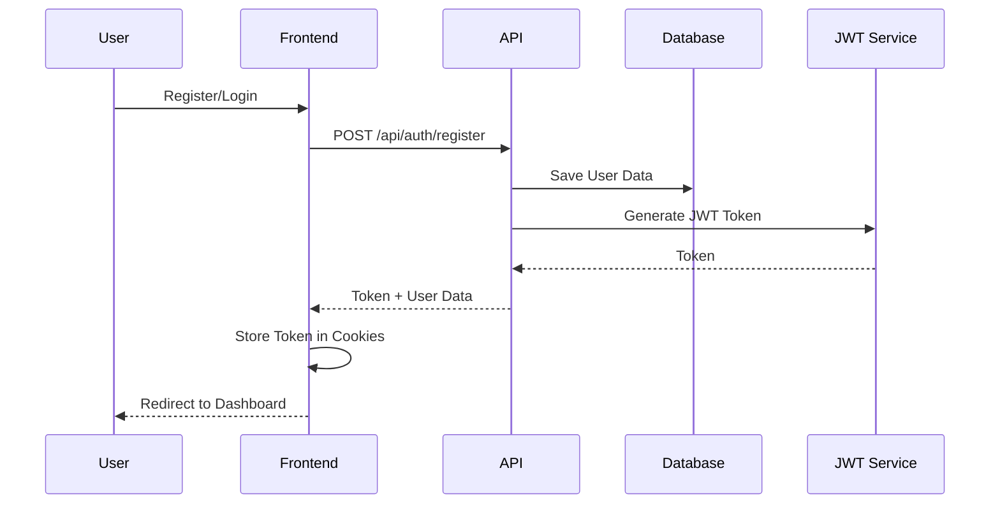
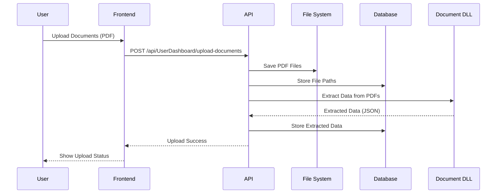
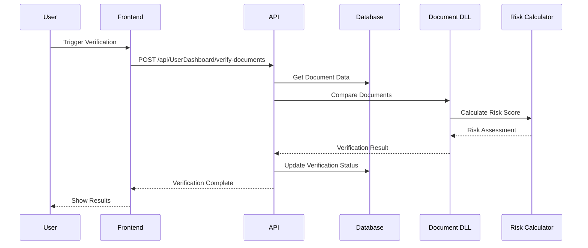
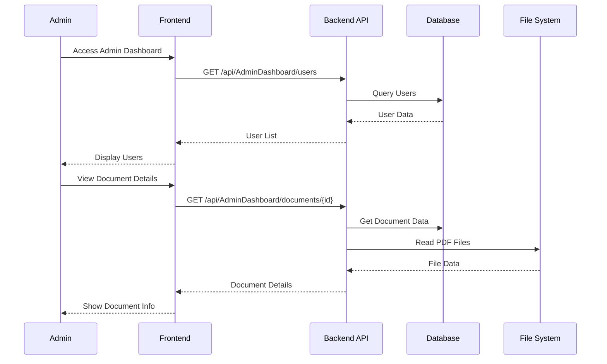

# Document Verification System - Technical Documentation

## 🏗️ System Architecture

### High-Level Architecture
```
┌─────────────────┐    ┌─────────────────┐    ┌─────────────────┐
│   React Frontend │    │   .NET Web API  │    │   SQL Server    │
│   (Port 3000)    │◄──►│   (Port 5194)   │◄──►│   Database      │
└─────────────────┘    └─────────────────┘    └─────────────────┘
         │                       │                       │
         │                       │                       │
         ▼                       ▼                       ▼
┌─────────────────┐    ┌─────────────────┐    ┌─────────────────┐
│   User Browser  │    │  Document DLL   │    │   File Storage   │
│   (Chrome/Firefox)│   │  (PDF Processing)│   │   (Uploads/)    │
└─────────────────┘    └─────────────────┘    └─────────────────┘
```

## 🔄 Data Flow Architecture

### 1. User Registration & Authentication Flow



### 2. Document Upload & Processing Flow



### 3. Document Verification Flow



### 4. Admin Dashboard Flow



## 🗄️ Database Schema & Relationships

### Entity Relationship Diagram

```
┌─────────────────┐
│      Users      │
│─────────────────│
│ Id (PK)         │
│ FullName        │
│ Email (Unique)  │
│ Phone           │
│ City            │
│ State           │
│ Pincode         │
│ PasswordHash    │
│ Role            │
│ CreatedAt       │
│ UpdatedAt       │
└─────────────────┘
         │
         │ 1:N
         ▼
┌─────────────────┐
│UserUploadedDocs │
│─────────────────│
│ Id (PK)         │
│ UserId (FK)     │
│ ECPath          │
│ AadhaarPath     │
│ PANPath         │
│ ExtractedData   │
│ IsVerified      │
│ RiskScore       │
│ VerificationNotes│
│ IsSubmitted     │
│ SubmittedAt     │
│ CreatedAt       │
│ UpdatedAt       │
└─────────────────┘
         │
         │ 1:N
         ▼
┌─────────────────┐
│OriginalDocuments│
│─────────────────│
│ Id (PK)         │
│ UserId (FK)     │
│ OriginalECPath  │
│ OriginalAadhaarPath│
│ OriginalPANPath │
│ OriginalExtractedData│
│ CreatedAt       │
│ UpdatedAt       │
└─────────────────┘
         │
         │ 1:N
         ▼
┌─────────────────┐
│UserActivityLogs │
│─────────────────│
│ Id (PK)         │
│ UserId (FK)     │
│ Activity        │
│ Description     │
│ IPAddress       │
│ UserAgent       │
│ Timestamp       │
└─────────────────┘
```

## 🔧 Technology Stack Details

### Backend Technologies

| Technology | Version | Purpose |
|------------|---------|---------|
| .NET 8 | 8.0.0 | Core Framework |
| ASP.NET Core | 8.0.0 | Web API Framework |
| Entity Framework Core | 8.0.0 | ORM |
| SQL Server | LocalDB | Database |
| JWT Bearer | 7.0.3 | Authentication |
| PDFPig | 0.1.8 | PDF Processing |
| BCrypt | 4.0.3 | Password Hashing |
| Swagger | 6.5.0 | API Documentation |

### Frontend Technologies

| Technology | Version | Purpose |
|------------|---------|---------|
| React | 18.2.0 | UI Framework |
| Bootstrap | 5.3.0 | CSS Framework |
| Axios | 1.6.0 | HTTP Client |
| React Router | 6.8.0 | Routing |
| js-cookie | 3.0.5 | Cookie Management |

### Development Tools

| Tool | Version | Purpose |
|------|---------|---------|
| Node.js | 18+ | JavaScript Runtime |
| npm | 9+ | Package Manager |
| Git | 2.40+ | Version Control |
| Visual Studio | 2022 | IDE |
| VS Code | 1.80+ | Code Editor |

## 🔐 Security Implementation

### Authentication Flow
```
1. User Login → JWT Token Generation
2. Token Storage → HTTP-Only Cookies
3. Request Authorization → Bearer Token
4. Token Validation → Claims Verification
5. Role-Based Access → Admin/User Permissions
```

### Security Features
- **JWT Authentication**: Secure token-based auth
- **Password Hashing**: BCrypt with salt
- **CORS Protection**: Configured for specific origins
- **Input Validation**: Model validation attributes
- **SQL Injection Prevention**: Entity Framework parameterized queries
- **File Upload Security**: PDF-only, size limits, virus scanning

## 📊 API Architecture

### RESTful API Design

```
Authentication Endpoints:
├── POST /api/auth/register
├── POST /api/auth/login
├── POST /api/auth/admin-login
└── GET /api/auth/verify

User Dashboard Endpoints:
├── GET /api/UserDashboard/profile
├── PUT /api/UserDashboard/profile
├── POST /api/UserDashboard/upload-documents
├── GET /api/UserDashboard/document-status
├── GET /api/UserDashboard/extracted-data
├── POST /api/UserDashboard/verify-documents
└── GET /api/UserDashboard/upload-history

Admin Dashboard Endpoints:
├── GET /api/AdminDashboard/users
├── GET /api/AdminDashboard/users/{id}
├── PUT /api/AdminDashboard/users/{id}/role
├── GET /api/AdminDashboard/documents
├── GET /api/AdminDashboard/documents/{id}
├── POST /api/AdminDashboard/documents/{id}/verify
├── GET /api/AdminDashboard/analytics
├── GET /api/AdminDashboard/activity-logs
└── GET /api/AdminDashboard/documents/{id}/download/{type}

Testing Endpoints:
├── GET /api/test/run-all-tests
├── GET /api/test/run-test/{number}
├── GET /api/test/test-descriptions
└── POST /api/test/simulate-verification
```

## 🧪 Testing Architecture

### Test Case Categories

1. **Perfect Match Tests**
   - All documents align perfectly
   - Risk Score: 0-30%
   - Status: VERIFIED

2. **Partial Match Tests**
   - Some documents match, others don't
   - Risk Score: 30-85%
   - Status: PENDING_REVIEW

3. **Complete Mismatch Tests**
   - All documents from different persons
   - Risk Score: 85-100%
   - Status: REJECTED

4. **Quality Issue Tests**
   - OCR extraction problems
   - Risk Score: 40-70%
   - Status: PENDING_REVIEW

### Test Data Structure
```json
{
  "testScenario": {
    "name": "Test Case Name",
    "aadhaarData": { "name": "John Doe", "dob": "15/03/1990" },
    "panData": { "name": "John Doe", "dob": "15/03/1990" },
    "ecData": { "name": "John Doe", "dob": "15/03/1990" },
    "expectedRiskScore": 5.0,
    "expectedStatus": "VERIFIED"
  }
}
```

## 📁 File Storage Architecture

### Directory Structure
```
webApitest/
├── Uploads/
│   └── UserDocuments/
│       ├── 123/                    # User ID
│       │   ├── EC_20240115143022.pdf
│       │   ├── Aadhaar_20240115143022.pdf
│       │   └── PAN_20240115143022.pdf
│       └── 124/
│           ├── EC_20240115144530.pdf
│           ├── Aadhaar_20240115144530.pdf
│           └── PAN_20240115144530.pdf
```

### File Naming Convention
- **Format**: `{DocumentType}_{Timestamp}.pdf`
- **Example**: `EC_20240115143022.pdf`
- **Timestamp**: `yyyyMMddHHmmss`

## 🔄 Business Logic Flow

### Document Verification Process

1. **Upload Phase**
   - User uploads 3 PDF documents
   - Files saved to user-specific directory
   - Database records created with file paths

2. **Extraction Phase**
   - DLL processes each PDF
   - Extracts structured data (Name, DOB, Address, etc.)
   - Calculates confidence scores

3. **Comparison Phase**
   - Cross-document field comparison
   - Identifies mismatches and discrepancies
   - Calculates risk scores

4. **Verification Phase**
   - Risk-based decision making
   - Generate verification results
   - Update database with results

5. **Notification Phase**
   - Update user dashboard
   - Send notifications (if configured)
   - Log activity for audit

## 🚀 Deployment Architecture

### Development Environment
```
┌─────────────────┐    ┌─────────────────┐    ┌─────────────────┐
│   React Dev     │    │   .NET API      │    │   SQL LocalDB   │
│   (localhost:3000)│   │   (localhost:5194)│   │   (Local)       │
└─────────────────┘    └─────────────────┘    └─────────────────┘
```

### Production Environment
```
┌─────────────────┐    ┌─────────────────┐    ┌─────────────────┐
│   React Build   │    │   .NET API      │    │   SQL Server    │
│   (Static Files)│    │   (IIS/Kestrel) │    │   (Cloud/Azure) │
└─────────────────┘    └─────────────────┘    └─────────────────┘
```

## 📈 Performance Considerations

### Backend Optimization
- **Async/Await**: All I/O operations are asynchronous
- **Connection Pooling**: Entity Framework connection pooling
- **Caching**: In-memory caching for frequently accessed data
- **File Streaming**: Efficient file upload/download

### Frontend Optimization
- **Code Splitting**: Lazy loading of components
- **Bundle Optimization**: Webpack optimization
- **Caching**: HTTP response caching
- **State Management**: Efficient state updates

### Database Optimization
- **Indexing**: Proper database indexes
- **Query Optimization**: Efficient LINQ queries
- **Connection Management**: Proper connection disposal
- **Migration Strategy**: Database versioning

## 🔍 Monitoring & Logging

### Logging Levels
- **Information**: General application flow
- **Warning**: Non-critical issues
- **Error**: Application errors
- **Debug**: Detailed debugging information

### Monitoring Points
- **API Response Times**: Track endpoint performance
- **Database Queries**: Monitor query execution
- **File Operations**: Track upload/download times
- **Authentication**: Monitor login attempts
- **Document Processing**: Track DLL processing times

## 🛡️ Security Considerations

### Data Protection
- **Encryption**: Sensitive data encryption
- **Access Control**: Role-based permissions
- **Audit Logging**: Complete activity tracking
- **Data Retention**: Configurable retention policies

### File Security
- **Virus Scanning**: Uploaded file validation
- **File Type Validation**: PDF-only uploads
- **Size Limits**: File size restrictions
- **Path Traversal Protection**: Secure file paths

---

**This technical documentation provides a comprehensive overview of the Document Verification System architecture, data flow, and implementation details.**
